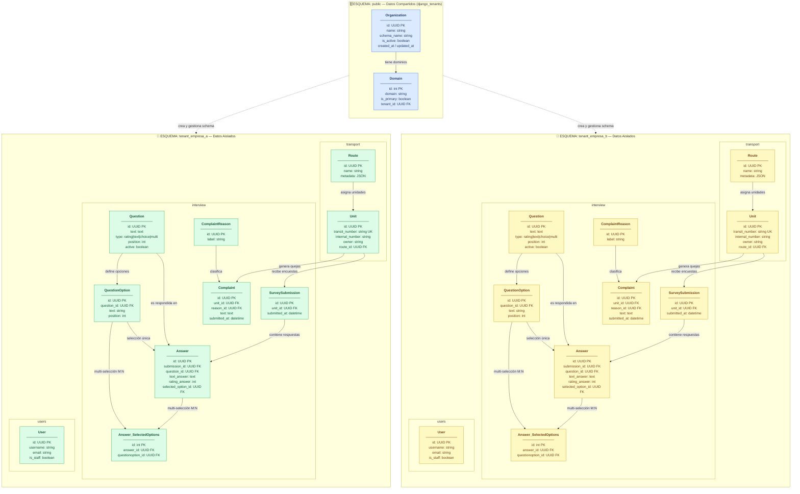
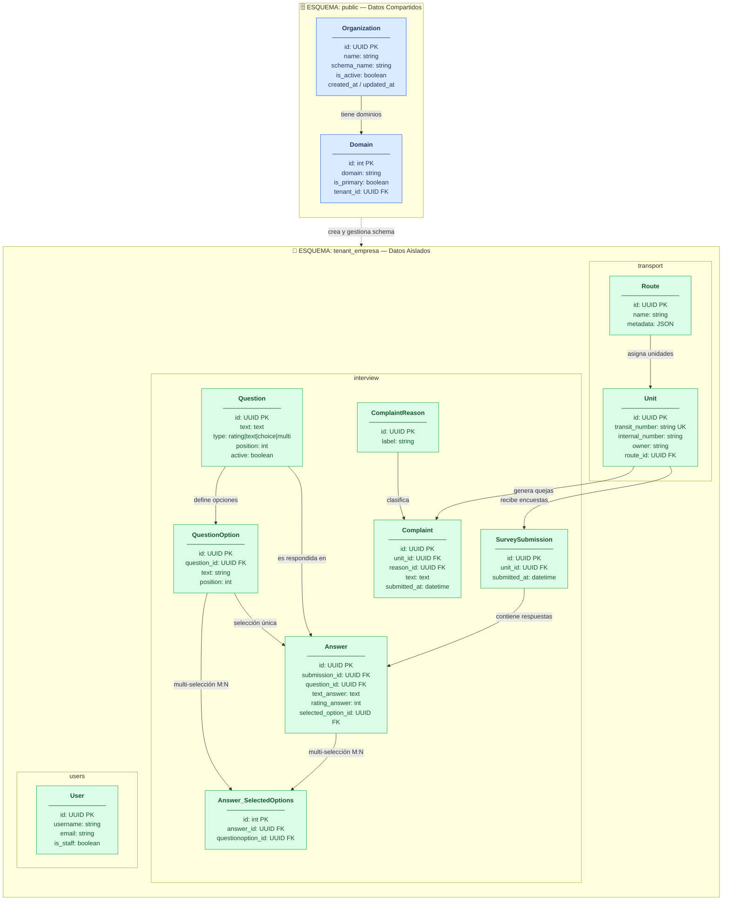

# ERD Multi-tenant (Django + django-tenants)

Este diagrama muestra la separación física de esquemas en PostgreSQL mediante secciones visuales:

- **`public`**: esquema compartido con los datos de tenancy (`Organization`, `Domain`).
- **`tenant_empresa_a` / `tenant_empresa_b`**: esquemas operativos completamente aislados, uno por organización. Cada uno replica el mismo conjunto de tablas de forma independiente.

> **Nota:** `QrGenerator` y `StatisticalSummary` son **modelos proxy** de Django y no generan tablas en la base de datos.
>
> El diagrama usa `graph TD` con `subgraph` en lugar de `erDiagram` para poder representar los cuadros de esquema. Las líneas discontinuas (`-.->`) indican la relación arquitectónica multitenant (cross-schema), no FKs físicas.

## Lectura rápida de arquitectura

| Esquema | Color | Contenido |
|---|---|---|
| `public` | Azul | `Organization` + `Domain` — datos de tenancy compartidos por toda la plataforma |
| `tenant_empresa_a` | Verde | Tablas operativas aisladas de la empresa A |
| `tenant_empresa_b` | Amarillo | Mismo conjunto de tablas, completamente independiente de A |

**Principios clave:**

- `Organization.schema_name` determina el nombre del esquema PostgreSQL que se crea automáticamente.
- Cada tenant tiene su propia instancia de tablas: no comparten filas, secuencias ni índices.
- Las líneas discontinuas (`-.->`) representan la relación arquitectónica de gestión de esquema, **no FKs físicas** entre esquemas.
- `django-tenants` enruta cada request al esquema correcto mediante el middleware `TenantMainMiddleware` y la resolución por dominio HTTP.

---

## ERD Simplificado — 1 Tenant

Diagrama reducido con un único tenant para mayor claridad.

| Esquema | Color | Contenido |
|---|---|---|
| `public` | Azul | `Organization` + `Domain` — datos de tenancy compartidos |
| `tenant_empresa` | Verde | Tablas operativas aisladas del tenant |
